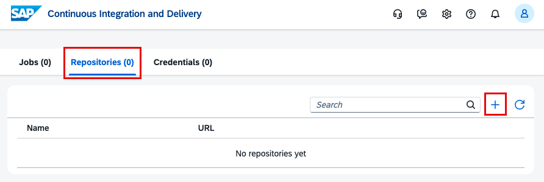
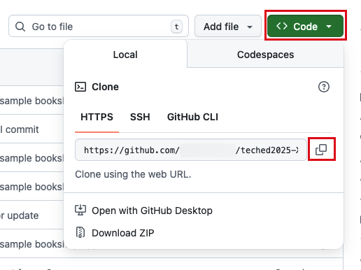
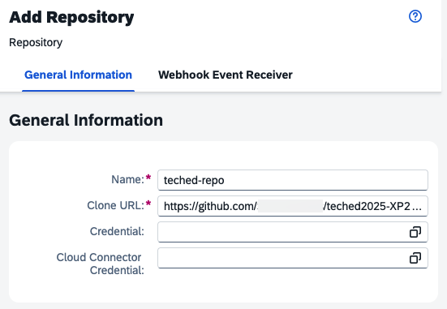
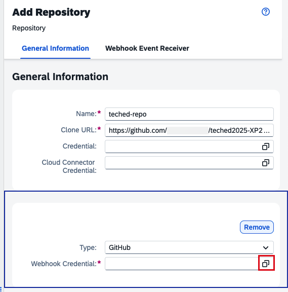
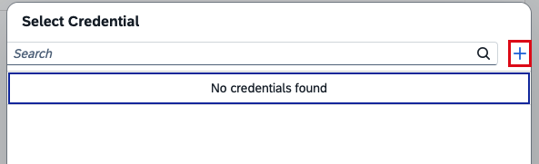
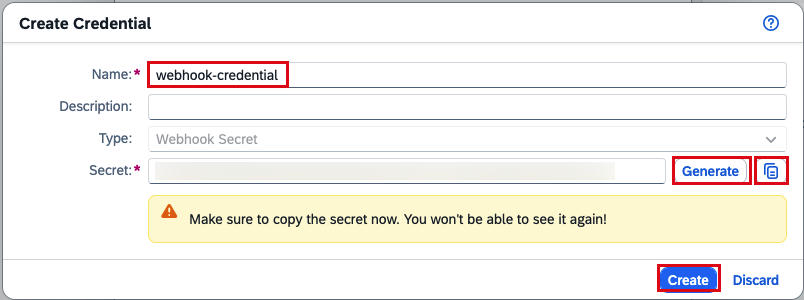
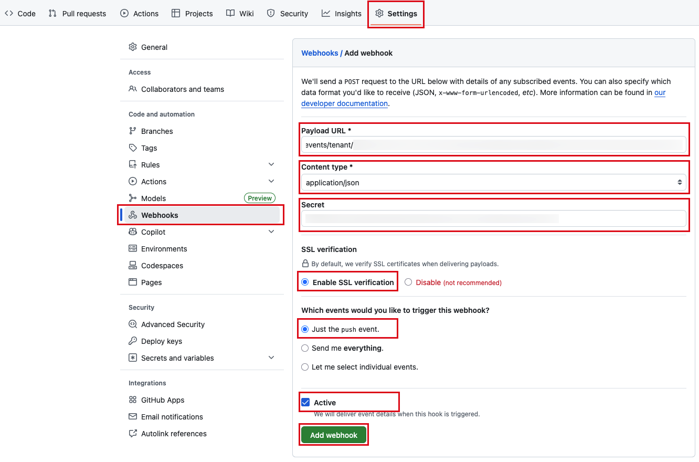

## Exercise 1 - Setup your Delivery Pipeline and Transport Landscape

In this exercise, you will define your delivery pipeline in SAP Continuous Integration nand Delivery service, createa job and configure the release step and transport landscape in SAP Cloud Transport Management Service.

# Exercise 1.1 - Open the Continuous Integration and Delivery Service

1. In your BTP subaccount named with **XP266_CENTRAl** in the SAP BTP cockpit, go to **Services -> Instances and Subscription**.
2. In the **Subscriptions** overview, choose **Continuous Integration & Delivery**. Now, the user interface of SAP Continuous Integration and Delivery opens.
     

## Exercise 1.0 - Add Your Repository in SAP CI CD Service

Connect SAP Continuous Integration and Delivery with the repository in which your sources reside.

1. In SAP Continuous Integration and Delivery, choose Repositories → **+** (Add).
     

1. In the Add Repository column view, add a **name** e.g. _teched-repo_
   
2. In GitHub, copy the HTTPS clone URL of the repository you just created in [Exercise 0](../ex0#exercicse-01---create-a-copy-of-this-repository) 
     

3. Paste it into the Clone URL field in the Add Repository column view.
     

4. Don't close the repos creation yet. In the next step we will add a GitHub webhook

## Exercise 1.1 - Create a Webhook

You can configure a webhook for your repository, which automatically triggers a build of your job once there is a change commit in the source code repository.

1. In the same view, click the button to create a new webhook credential.
     

2. In the new popup, click the **+** button to create a new webook credential.
     

3. Another Create Credential popup opens. Here choose a neme e.g. _webhook_credential_.
4. Generate a secret by clicking the **Generate** button.
5. **Copy** and note down this secret, you will need it in GitHub and click the **create** button.
     

6. Click **add** to add the repository.
     

7. Click on the newly added repo and note down the _Payload URL_ in **Webhook Event Receiver section**
     

8. In your project in GitHub, go to the **Settings** tab.

9. From the navigation pane, open **Webhooks**, then click on Add webhook.

10. Enter the Payload URL, Content type, and Secret from the Webhook Data pop-up in SAP Continuous Integration and Delivery. For all other settings, leave the default values.

11. Click on **Add webhook**.
 

## Exercise 1.2 - Create a Pipeline Job

1. In SAP Continuous Integration and Delivery, go to the Jobs tab and click on + (Create job).
2. In the General Information section of the Create Job pane, enter the following values:

    - Job Name: Freely choose a unique name for your job. We recommend using a name that contains both your GitHub project name and branch e.g. _my-teched-job_
    - Repository: Select the repository you just created (if not already selected).
    - Branch: Enter _main_.
    - Pipeline: Keep the default SAP Fiori in the Cloud Foundry environment.

3. In the Stages section, keep the default Job Editor as Configuration Mode.

4. In the Build section, Keep mta as Build Tool and choose Java 21 Node 20 as Build Tool Version.

5. Go to the relase step and add cTMS service instance credentials.
   
6. Create a new cTMS credential

7. In your SAP BPT central account, go to subscruptions, instances click the Transport Management Service key.
   
8. Copy the entire service key to the release stage in SAP Continous Delivery Service.

9.  Click on Create. You've successfully created your first CI/CD job with the Build stage and release enabled. 

Changes commited to your Github reposstiroy will be automatically picked up by your delivery pipeline. But before transport request is received by _SAP Cloud Transport Mangement service_, you need to create your transport landscape.

## Exercise 1.3 - Create Transport Landscape in SAP Cloud Transport Management Service

1. In your **CENTRAL** SAP BTP subaccount, got to subscruptions and instances and click the subscription **SAP Cloud Transport Mangement**.

2. The overview page of **SAP Cloud Transport Management** where you navigate to **Landscape visualization**

3. We will not create a new transport landscape. This containts the craiton of 3 transport nodes and 2 transport nodes.

4. Click the **+** sign to create your DEV node:

5. Repeat this step for your QA node and PRD node. For thos nodes don't tick the **Allow upload** checkbox.

6. Now we create the **Transport Routes**. Click the connector button to create a new route.

7. The first route connects the DEV to QA.
   - Name: DEV_to_QA
   - Source Node: DEV
   - Target Node: QA
8. Repeat the same to connect your QA and PRD node.
   - Name: QA_to_PRD
   - Source Node: QA
   - Target Node: PRD

## Summary

You've now set up SAP Continuous Integration and Delivery, added your GitHub repository to the service, configured a webhook, and created your first CI/CD job.

You also created your first transport landscape. At this you have everything setup to start feature definintion and development.

Continue to - [Maintain your Feature in Cloud ALM](../ex2/README.md)