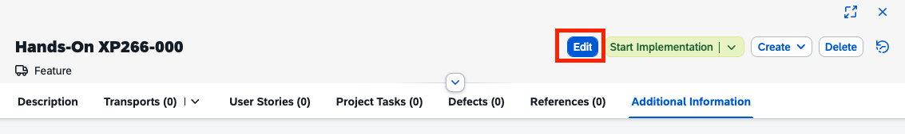
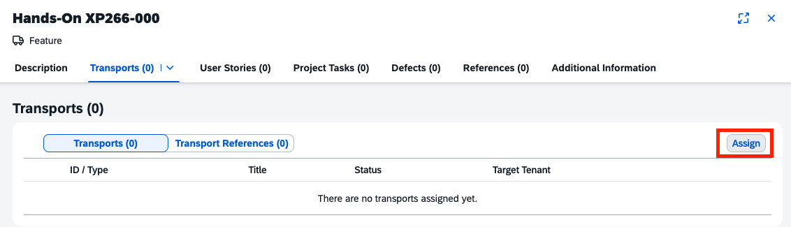
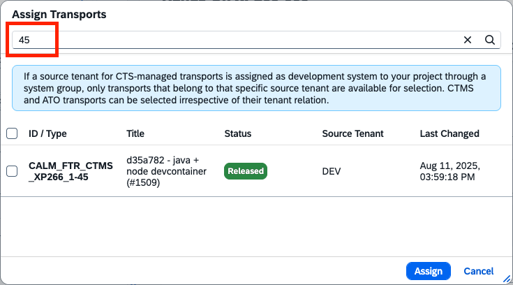
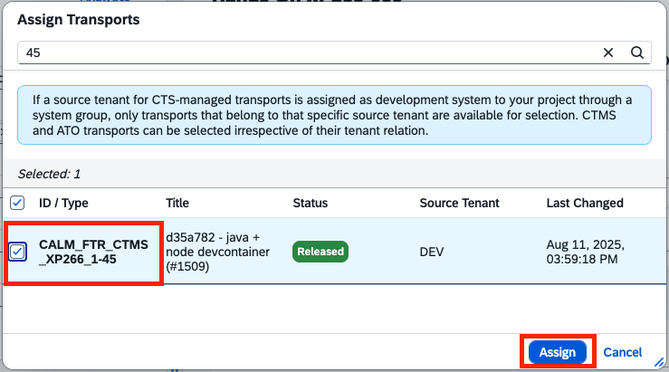
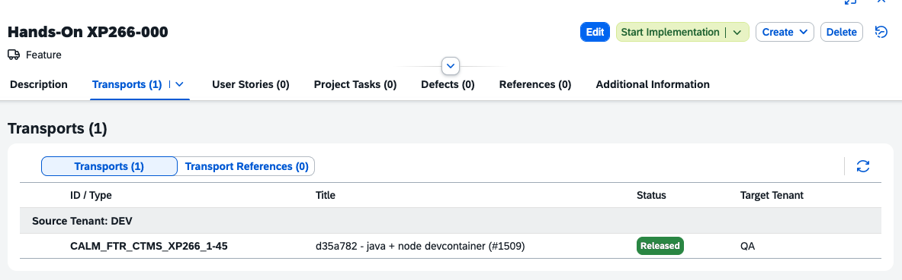
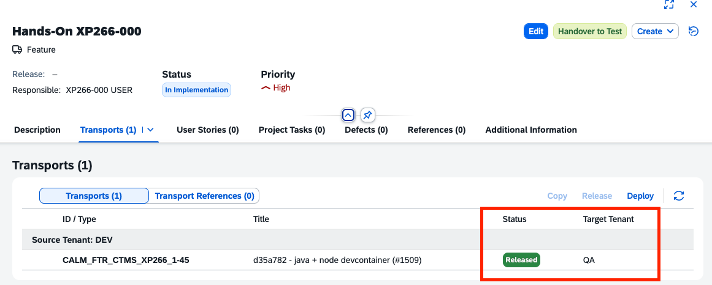
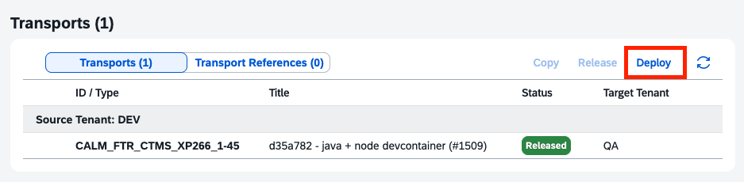
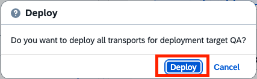
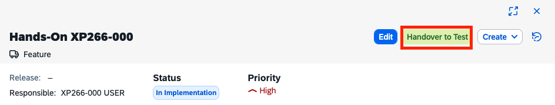
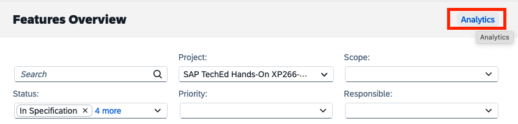

# Exercise 6 - Manage your Feature in Cloud ALM & Deployment

In this exercise, we will manage the assignment and deployment of Cloud Transport Management service transport requests in SAP Cloud ALM. By managing the lifecycle of your Feature you can keep track of your changes with a governed process. This includes confirmation of successful test in QA and the apporval for the deployment to the production environment. Eventually you can validate the deployed application in the production environment.

## Exercise 6.0 - Manage the lifefcylce of your feature

1. Go to the Features application in [SAP Cloud ALM](https://xp266-calm-lf1zy9xc.authentication.eu10.hana.ondemand.com/login).
2. Go to your the Feature created in exercise 2.

3. Switch to Edit mode.

4. Go to the Transports section and click "Assign".

5. In the selection dialog search for your transport ID (prefix is the destination name of the connection between Cloud ALM and CTMS).

6. Select the transport and click "Assign".

7. Save and Close the Feature.
8. The Transport is assigned to your Feature.

   
## Exercise 6.1 - Deploy and monitor changes in your QA and Prod environment

1. The transport in the Transports section is released and shows the CTMS target node as target tenant.

2. Click "Deploy" and confirm the deployment to the target node in the dialog.

3. Use the Refresh button on the Transports Section to retrieve the Import Result.
4. As soon as the import is succeeded the status changes to Deployed in <Target Tenant>.
5. Now you can change the Feature status to "In Testing" by clicking "Handover to Test".

6. The action "Confirm Successful Test" will be executed centrally.
7. Click on Analytics in the top right corner to access the Feature Traceability.

8. Check whether your feature is in status "Successfully Tested".
9. Now you can approve the Feature for Production by clicking "Approve for Production".
10. In status "Approved for Production" you can trigger the deployment to production by clicking "Deploy" in the Transports section.
11. Refresh the section to retrieve the import result.

## Exercise 6.2 - Find and access the deployed applications

After completing these steps you will have...

## Summary

You've now done
